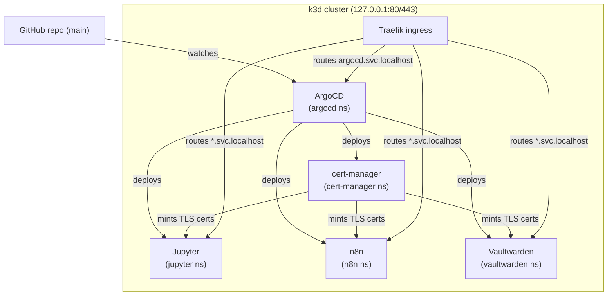

# service-platform-template

A fork-and-run Kubernetes selfhost template: ArgoCD + cert-manager + GitOps + three working apps (Jupyter, n8n, Vaultwarden) on a local k3d cluster. No AWS account required.

## What this is

Fork this repo, run five `make` commands, and you'll have Jupyter Notebook, n8n workflow automation, and Vaultwarden (Bitwarden-compatible password manager) running locally over HTTPS — with ArgoCD watching your repo so every `git push` deploys itself. The whole stack runs inside a single [k3d](https://k3d.io/) cluster on your machine, bound to `127.0.0.1:80` and `127.0.0.1:443`. No cloud account, no billing, no VMs to manage. Secrets (the n8n encryption key, the Vaultwarden admin token) are auto-generated the first time you run `make init-env` and applied to the cluster as Kubernetes Secrets before ArgoCD ever syncs.

The template is designed for developers who want a real GitOps workflow at home. You get the same primitives you'd use in production — Helm charts, ArgoCD Applications, cert-manager TLS, Traefik ingress — but at laptop scale. The repo structure enforces a clean split between cluster-level infrastructure and portable workloads, so you can reason about what lives where. Adding your own app means writing a `values-dev.yaml` and an ArgoCD `Application` manifest; the GitOps loop handles the rest from there.

This is a single-node, single-user setup. There's no high availability, no node autoscaling, and no multi-tenancy. It's a great environment for automation experiments, private note-taking, personal password management, and learning Kubernetes operations without AWS or GKE getting in the way. If you later want to move to a real cluster, the workload manifests travel cleanly — only the infra layer needs replacing.

## What this isn't

This template is **not** a production-grade platform. It runs one Kubernetes node (k3d in Docker), uses a self-signed TLS issuer that browsers won't trust by default, and stores all workload data in local PersistentVolumeClaims that are **deleted** when you run `make k8s-down`. There's no replication, no pod disruption budgets, no node autoscaling, and no external backup strategy. If your laptop dies, your n8n workflows and Vaultwarden vault go with it unless you've exported them manually.

It's also not JupyterHub — there's a single Jupyter pod accessible via a single shared token. If you need per-user notebooks, look at [JupyterHub](https://jupyterhub.readthedocs.io/). Use this template for dev, lab, personal automation, and learning Kubernetes operations.

## Architecture in 60 seconds

Every component is either **infra** (cluster-bound: ArgoCD, cert-manager, Traefik) or **workload** (portable: Jupyter, n8n, Vaultwarden). The rule is simple: if removing the component would require re-bootstrapping the cluster, it's infra; if it could run on any cluster unchanged, it's a workload. This keeps workload manifests self-contained in `deploy/apps/<svc>/` and infra config in `argocd/` and `cert-manager/`.

The cluster runs ArgoCD, which watches this repo's `main` branch and reconciles everything else via a two-tier app-of-apps cascade: a root Application manages `infra-app-of-apps` (cert-manager) and `apps-app-of-apps` (the three workloads). TLS certificates are minted on-demand by cert-manager's built-in `selfSigned` ClusterIssuer. Traefik (bundled with k3d) handles ingress routing for all `*.svc.localhost` hostnames.



The app-of-apps hierarchy means you can add a new workload by dropping a single YAML file into `deploy/argocd/apps/` and pushing. ArgoCD detects the new Application automatically — no `helm install`, no manual `kubectl apply` after initial setup.

See [docs/architecture.md](docs/architecture.md) for the full two-tier model, GitOps loop sequence diagram, secrets pattern, and a directory-level map.

## Quickstart

**Prerequisites:** Docker (Engine on Linux or Desktop on macOS), ~4 GB free RAM, ~10 GB free disk. On Windows, run inside WSL 2.

> **Host tooling:** Step 2 (`make install-deps`) installs the CLIs this template needs (k3d, helm, kubectl, argocd, …) into `~/.local/bin`, so the template is self-contained. If you want a reproducible, idempotent host setup on **Ubuntu 24.04**, the companion repo **[lab-soe](https://github.com/hjr15/lab-soe)** provisions the same tooling (plus k9s, Tilt, Terraform, AWS CLI) via a single `./bootstrap.sh`. Recommended if you run several labs; `make install-deps` is the standalone, cross-platform fallback otherwise.

```bash
# 1. Clone your fork
git clone https://github.com/<your-fork>/service-platform-template
cd service-platform-template

# 2. Install CLI tools (k3d, helm, kubectl, argocd — idempotent)
make install-deps

# 3. Create .env and auto-generate secrets
make init-env

# 4. Create k3d cluster, install ArgoCD, bootstrap secrets, apply root app
make k8s-up

# 5. Print the /etc/hosts lines you need to add
make print-hosts
```

`make k8s-up` finishes when ArgoCD is ready and the root Application manifest has been applied. It does **not** wait for all workloads — those reconcile asynchronously. The three workloads take another **3–5 minutes** to sync: cert-manager installs first (sync wave -1), then Jupyter, n8n, and Vaultwarden.

Add the hosts entries printed by `make print-hosts`:

```bash
# The exact line to paste depends on your DOMAIN (default: svc.localhost)
sudo sh -c 'cat >> /etc/hosts <<HOSTS
127.0.0.1 argocd.svc.localhost jupyter.svc.localhost n8n.svc.localhost vaultwarden.svc.localhost
HOSTS'
```

Watch ArgoCD reconcile (all four Applications should reach `Synced / Healthy`):

```bash
kubectl get app -n argocd -w
```

Once everything is healthy, open the URLs below. If ArgoCD shows an Application as `OutOfSync` or `Degraded`, check [docs/troubleshooting.md](docs/troubleshooting.md) before digging into pod logs.

**What each step does:**

| Step | What happens |
|------|-------------|
| `make install-deps` | Downloads k3d, helm, kubectl, argocd CLI, and a few supporting tools to `~/.local/bin` (Linux) or via Homebrew (macOS). Idempotent — safe to re-run. |
| `make init-env` | Copies `.env.example` to `.env`, then auto-generates `N8N_ENCRYPTION_KEY` (`openssl rand -hex 32`) and `VAULTWARDEN_ADMIN_TOKEN` (`openssl rand -hex 48`). Skips any var already set. |
| `make k8s-up` | Creates the k3d cluster with ports 80/443 bound to 127.0.0.1; installs ArgoCD via Helm; applies workload Secrets from `.env`; applies the root Application manifest. |
| `make print-hosts` | Prints the exact `127.0.0.1 ...` line for your current `DOMAIN` value so you can copy-paste it into `/etc/hosts`. |

## URLs after default setup

| App | URL | First-run setup |
|-----|-----|-----------------|
| ArgoCD | http://argocd.svc.localhost | Username `admin`, password from `make argocd-pw` |
| Jupyter | https://jupyter.svc.localhost | Copy token from `kubectl logs -n jupyter deploy/jupyter \| grep token=` |
| n8n | https://n8n.svc.localhost | Complete the owner setup wizard (email + password) |
| Vaultwarden | https://vaultwarden.svc.localhost | Complete the owner setup wizard (email + master password — do not lose this) |

**Browser TLS warning:** The default setup uses cert-manager's `selfSigned` ClusterIssuer. Your browser will show a "certificate not trusted" warning on every URL. You can safely proceed — everything works. If you want a real trusted cert, see [docs/cert-manager.md](docs/cert-manager.md).

**ArgoCD note:** ArgoCD runs on plain HTTP at `http://argocd.svc.localhost` (port 80) — TLS termination is skipped for the ArgoCD server in this template's default config. See [docs/architecture.md](docs/architecture.md#tls) for why.

**Vaultwarden:** `signupsAllowed` is set to `false` by default. The first account you create via the setup wizard becomes the owner and is the only one that can add further users via the admin panel (reached at `/admin` with your `VAULTWARDEN_ADMIN_TOKEN`). Don't lose the master password — there's no recovery path in a local setup.

## Documentation

The `docs/` directory has the full reference. Start with setup.md if you're setting up for the first time; jump to adding-an-app.md once you're running and want to extend the stack.

- [docs/architecture.md](docs/architecture.md) — the two-tier infra/workload model, GitOps loop sequence diagram, app-of-apps cascade, secrets pattern, TLS overview
- [docs/setup.md](docs/setup.md) — detailed step-by-step walkthrough from clone through first login, env var reference, smoke tests, teardown
- [docs/adding-an-app.md](docs/adding-an-app.md) — how to add your own app: find a chart, write values, write an ArgoCD Application, handle secrets, push and watch
- [docs/argocd.md](docs/argocd.md) — what ArgoCD is, how it works in this setup, common ArgoCD CLI commands
- [docs/cert-manager.md](docs/cert-manager.md) — TLS setup, default self-signed issuer, upgrading to Let's Encrypt with DNS-01
- [docs/compose-quickstart.md](docs/compose-quickstart.md) — try the apps with Docker Compose (no Kubernetes needed)
- [docs/ghcr-mirror.md](docs/ghcr-mirror.md) — optional GHCR-hosted Helm chart mirror if you want to avoid pulling from upstream registries
- [docs/troubleshooting.md](docs/troubleshooting.md) — common failures and fixes (ImagePullBackOff, cert not issuing, ingress 404, pods stuck Pending)

## Want real (trusted) certs?

The default setup uses cert-manager's built-in `selfSigned` ClusterIssuer. Certificates are valid and encryption works, but every browser will show a "not trusted" warning because the issuer is not in any trust store. This is fine for local use.

If you point a real domain at your machine — or set up split-horizon DNS so a public domain resolves locally — you can switch to Let's Encrypt ACME DNS-01. The template ships example ClusterIssuer manifests for Route 53 under `docs/examples/cert-manager-letsencrypt-route53/`, and the relevant env vars (`ACME_EMAIL`, `AWS_ACCESS_KEY_ID`, `AWS_SECRET_ACCESS_KEY`, `AWS_HOSTED_ZONE_ID`) are already stubbed out in `.env.example`. See [docs/cert-manager.md](docs/cert-manager.md) for the full upgrade path.

## Updating workload versions

Workload image tags and chart versions are pinned in each app's `values-dev.yaml`. To update Jupyter's image, edit `deploy/apps/jupyter/values-dev.yaml` and change `image.tag`. Push to main; ArgoCD detects the change within its reconciliation interval (~60 seconds by default) and rolls out the update.

The repo includes a [Renovate](https://docs.renovatebot.com/) config (`renovate.json`) that can open PRs for upstream chart and image bumps automatically once you connect it to your fork. Renovate tracks the pinned versions in `scripts/install-deps.sh` as well.

## Teardown

```bash
make k8s-down    # deletes the k3d cluster and all PVCs — workload data is gone
make k8s-reset   # same as k8s-down, then immediately recreates from scratch
```

PVC deletion means n8n workflows, Jupyter notebooks, and the Vaultwarden database are all wiped. Export what matters before running either command. If you only want to stop the cluster without destroying it, use `k3d cluster stop service-platform` and `k3d cluster start service-platform` instead.

## License

MIT — see [LICENSE](LICENSE).
