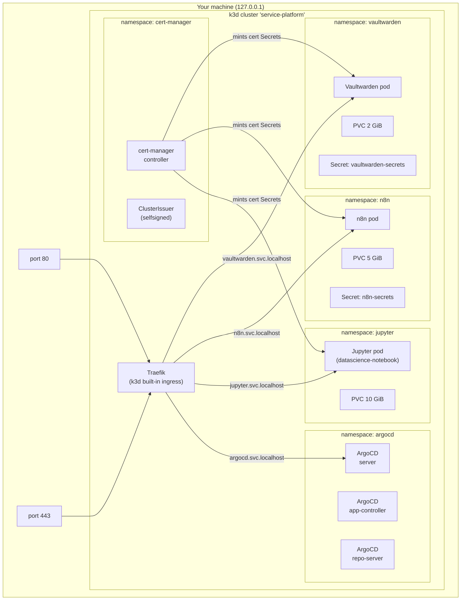
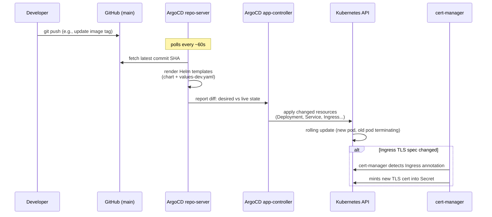
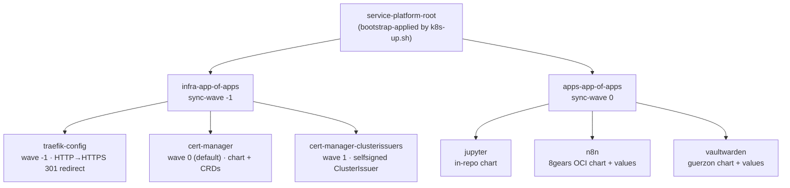

# Architecture

This document explains how the template is organized, why it's organized that way, and what actually happens when you push a commit.

If you're just trying to get up and running, start with [docs/setup.md](setup.md). Come back here when you want to understand the "why" behind a structural decision, or before you start extending the template with new apps.

## Two tiers: infra and workload

Every component in the cluster belongs to one of two tiers. The split is a design principle, not just a folder convention:

> **Decision rule:** "Could this component run unchanged on a different cluster?" If yes, it's a workload. If its configuration is bound to this specific cluster's existence (hostnames, secrets bootstrap, ingress config), it's infra.

| Infra | Workload |
|-------|----------|
| k3d cluster itself | Jupyter |
| ArgoCD | n8n |
| cert-manager + ClusterIssuers | Vaultwarden |
| Traefik ingress (k3d built-in) | *(any app you add)* |
| ArgoCD app-of-apps manifests | |
| Workload secret bootstrap scripts | |

**Why does this matter?** When workloads are kept portable, they can move to a cloud cluster or a different machine with minimal changes. Only the infra layer needs replacing. The workload `values-dev.yaml` files reference `${DOMAIN}` for hostnames and `existingSecret` for sensitive values, so they don't embed cluster-specific assumptions inline.

Infra lives in `argocd/`, `cert-manager/`, and `scripts/`. Workloads live in `deploy/apps/<svc>/`. ArgoCD Application manifests for workloads live in `deploy/argocd/apps/` and are managed by the apps-app-of-apps (see below).

## Cluster topology



All hostnames resolve to `127.0.0.1` via `/etc/hosts` entries. Traefik terminates TLS connections using Secrets that cert-manager writes. Each workload namespace contains exactly one pod, one PVC, and (for n8n and Vaultwarden) one Secret that was applied before ArgoCD synced.

## GitOps loop



ArgoCD's reconciliation interval is 60 seconds (configured in `argocd/values-dev.yaml` via `timeout.reconciliation: 60s`). That means after a `git push`, you'll typically see the Application go `OutOfSync` within a minute and `Synced` a minute or two after that, depending on how long the Kubernetes rollout takes. During the initial cluster bootstrap, cert-manager has to install its CRDs first; the infra sync wave ensures this happens before any workload tries to create a `Certificate` object.

**Self-heal is enabled.** If someone edits a resource in-cluster directly (e.g., `kubectl edit deployment jupyter`), ArgoCD will revert it on the next reconciliation cycle. Treat the git repo as the single source of truth. The only resources ArgoCD does not own are the workload Secrets applied by `k8s-up.sh` Phase 3 — those are intentionally outside ArgoCD's sync scope.

**Pruning is enabled.** If you delete an Application manifest from the repo, ArgoCD will delete the corresponding Kubernetes resources on the next sync. This is intentional — it prevents ghost resources from accumulating when you rename or remove apps.

**What ArgoCD is not doing here:** It's not managing the k3d cluster itself, not managing Traefik (that's k3d's built-in), and not managing the workload Secrets. Those three things are handled by the bootstrap scripts and k3d defaults.

## App-of-apps tier structure

The cluster runs a three-level ArgoCD Application hierarchy. The root
Application is the only one applied by hand (`scripts/k8s-up.sh` Phase 4);
everything below it is discovered and reconciled by ArgoCD. Sync-wave
annotations order the rollout so infra converges before workloads:



Sync waves run lowest-first: `traefik-config` (-1) installs the cluster-wide
HTTP→HTTPS redirect, `cert-manager` (no annotation → default wave 0) installs
the controller and CRDs, then `cert-manager-clusterissuers` (1) registers the `selfsigned`
ClusterIssuer — guaranteeing the issuer exists before any workload Ingress
asks cert-manager for a certificate.

This is the directory layout that produces the above:

```
deploy/argocd/
├── service-platform-root-app.yaml    # the root — watches this directory
├── infra-app-of-apps.yaml            # infra tier orchestrator
├── apps-app-of-apps.yaml             # apps tier orchestrator
├── infra/
│   ├── traefik-config-app.yaml
│   ├── cert-manager-app.yaml
│   └── cert-manager-clusterissuers-app.yaml
└── apps/
    ├── jupyter-app.yaml
    ├── n8n-app.yaml
    └── vaultwarden-app.yaml
```

The sync wave annotation (`argocd.argoproj.io/sync-wave: "-1"` on the infra tier) guarantees cert-manager is installed and its CRDs are registered before any workload Application tries to create a `Certificate` object.

**Adding a new app** is as simple as dropping a new `<name>-app.yaml` into `deploy/argocd/apps/` and pushing. The `apps-app-of-apps` watches that directory and picks up the new Application automatically. See [docs/adding-an-app.md](adding-an-app.md) for a worked example.

**Multi-source Applications:** n8n and Vaultwarden use ArgoCD's multi-source feature — one source is the upstream Helm chart (OCI or HTTP registry), the second source is this git repo acting as a values reference. This avoids vendoring chart code into the repo while still keeping values version-controlled. Jupyter uses a simpler single-source setup because the chart lives in-repo at `deploy/apps/jupyter/chart/`.

## Secrets pattern

Workload secrets (encryption keys, admin tokens) are sensitive enough that they should not be committed to the repo in plaintext. This template uses a **bootstrap-applied** approach rather than SOPS-in-git:

1. `make init-env` → `scripts/init-env.sh` reads `.env.example`, generates random values for any var marked `# auto-generate:`, and writes them to `.env` (git-ignored).
2. `make k8s-up` → `scripts/k8s-up.sh` Phase 3 reads `.env` and applies Kubernetes `Secret` objects directly with `kubectl apply`:
   - `n8n-secrets` in namespace `n8n` (contains `N8N_ENCRYPTION_KEY`)
   - `vaultwarden-secrets` in namespace `vaultwarden` (contains `ADMIN_TOKEN`)
3. Each ArgoCD Application's Helm values reference these pre-existing Secrets via `existingSecret`:
   - n8n: `main.secret.n8n.encryption_key.existingSecret: n8n-secrets`
   - Vaultwarden: `adminToken.existingSecret: vaultwarden-secrets`
4. ArgoCD **never** manages these Secret objects — they're outside its sync scope. If you run `make k8s-reset`, Phase 3 re-applies them before the Application reconciles.

**Why not SOPS + ArgoCD CMP?** The SOPS + Config Management Plugin approach is more elegant (secrets live in git, encrypted) but requires building or hosting a custom ArgoCD repo-server sidecar image — either from scratch (ArgoCD base + helm-secrets + sops + age), or using a third-party plugin like argocd-vault-plugin. For two secrets in a local dev template, that operational overhead isn't warranted. The bootstrap pattern is transparent, easy to debug, and works without any additional infrastructure. If you want SOPS, `scripts/install-deps.sh` already installs `sops` and `age` — you have the tools, just not the ArgoCD wiring.

**Rotating a secret:** Change the value in `.env`, re-run `scripts/k8s-up.sh` (Phase 3 is idempotent), and restart the affected workload pod. For n8n, rotating `N8N_ENCRYPTION_KEY` invalidates stored credentials — n8n will need re-authentication for connected services. For Vaultwarden, the `ADMIN_TOKEN` only affects the `/admin` panel; vault data is unaffected.

**.env is git-ignored.** Never commit `.env`. The `.gitignore` excludes it. If you accidentally push secrets, rotate them immediately by re-running `make init-env` (it regenerates only placeholders by default — manually update the leaked values) and `kubectl apply` the updated Secrets.

## TLS

cert-manager is installed via Helm and managed by the `infra-app-of-apps`. Two Application manifests handle it:
- `cert-manager-app` — installs the cert-manager CRDs and controller (jetstack/cert-manager chart)
- `cert-manager-clusterissuers-app` — applies `cert-manager/clusterissuer-selfsigned.yaml`, creating the `selfsigned` ClusterIssuer

Each workload Ingress carries the annotation `cert-manager.io/cluster-issuer: selfsigned`. When cert-manager sees a new Ingress with that annotation, it creates a `Certificate` object and mints a self-signed cert into a Secret (e.g., `jupyter-tls`). Traefik picks up that Secret via the Ingress TLS stanza.

The cert lifecycle for a new workload looks like this:

```
Ingress created (annotation: cert-manager.io/cluster-issuer: selfsigned)
  → cert-manager creates Certificate object
    → cert-manager creates CertificateRequest
      → selfSigned issuer signs it immediately (no external call)
        → cert stored in Secret (e.g., jupyter-tls)
          → Traefik serves TLS using that Secret
```

Because the issuer is `selfSigned`, there are no rate limits, no DNS validation, and no external network calls for the TLS step. The downside is that the cert has no chain of trust — browsers show the warning and curl requires `-k`. If you add the cert's CA to your system trust store, the warning goes away for that browser on that machine.

**ArgoCD TLS exception:** ArgoCD itself does not use cert-manager. It runs in insecure mode (`server.insecure: true`, `--insecure` flag) behind Traefik, which routes it on HTTP port 80. This is a deliberate simplification for local dev — the ArgoCD API server's self-signed cert would cause ArgoCD CLI's gRPC calls to fail unless you skip verification, which is messy. HTTP-behind-ingress is cleaner for a local-only setup.

**Upgrading to Let's Encrypt:** The repo ships example ClusterIssuer manifests for Route 53 DNS-01 under `docs/examples/cert-manager-letsencrypt-route53/`. Switching involves: adding your AWS credentials to `.env`, applying the Route 53 credentials Secret, deploying the ACME ClusterIssuer, swapping the `cert-manager.io/cluster-issuer` annotation on each Ingress from `selfsigned` to `letsencrypt-prod`, and pushing. See [docs/cert-manager.md](cert-manager.md) for the step-by-step.

## Where to look

| I want to... | Look in... |
|---|---|
| Change a workload's image tag | `deploy/apps/<svc>/values-dev.yaml` → `image.tag` |
| Change a workload's resource limits | `deploy/apps/<svc>/values-dev.yaml` → `resources.limits` |
| Change a workload's hostname | `deploy/apps/<svc>/values-dev.yaml` → ingress host fields |
| Add a new workload | Create `deploy/apps/<newapp>/values-dev.yaml` and `deploy/argocd/apps/<newapp>-app.yaml` |
| Change ArgoCD's config (reconcile interval, etc.) | `argocd/values-dev.yaml` |
| Add a new ClusterIssuer | `cert-manager/` — add a YAML file, it's picked up by the clusterissuers Application |
| Change which chart version n8n uses | `deploy/argocd/apps/n8n-app.yaml` → `targetRevision` |
| Add a new secret | Add to `.env.example` with `# auto-generate:` comment, extend `scripts/k8s-up.sh` Phase 3, reference via `existingSecret` in values |
| Tear down the cluster | `make k8s-down` (data gone) or `k3d cluster stop service-platform` (data preserved) |
| Understand why a sync is failing | `kubectl describe app <name> -n argocd` or check the ArgoCD UI at http://argocd.svc.localhost |
